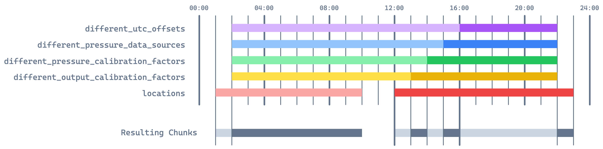

# EM27 Metadata

## The purpose of this library

This repository is the single source of truth for our EM27 measurement logistics: "Where has each station been on each day of measurements?" We selected this format over putting it in a database due to various reasons:

-   Easy to read, modify and extend by selective group members using GitHub permissions
-   Changes to this are more evident here than in database logs
-   Versioning (easy to revert mistakes)
-   Automatic testing of the files integrities
-   Easy import as a statically typed Python library

<br/>

## How it works

This repository only contains a Python library to interact with the metadata. The metadata itself is stored in local files or a GitHub repository. The library can load the metadata from both sources and provides a unified interface with static types to access it.

<br/>

## Library Usage

Install as a library:

```bash
poetry add tum-esm-em27-metadata
# or
pip install tum-esm-em27-metadata
```

```python
import pendulum
import tum_esm_em27_metadata

em27_metadata = tum_esm_em27_metadata.load_from_github(
    github_repository="org-name/repo-name",
    access_token="your-github-access-token",
)

# or load it from local files
em27_metadata = tum_esm_em27_metadata.load_from_local_files(
    locations_path="location-data/locations.json",
    sensors_path="location-data/sensors.json",
    campaigns_path="location-data/campaigns.json",
)

metadata = em27_metadata.get(
    sensor_id = "ma",
    from_datetime = pendulum.DateTime(
        year=2022, month=6, day=1, hour=0, minute=0, second=0
    ),
    to_datetime = pendulum.DateTime(
        year=2022, month=6, day=1, hour=23, minute=59, second=59
    ),
)

print(metadata)

```

Prints out:

```json
[
    {
        "sensor_id": "ma",
        "serial_number": 61,
        "from_datetime": "2022-06-01T00:00:00+00:00",
        "to_datetime": "2022-06-01T23:59:59+00:00",
        "location": {
            "location_id": "TUM_I",
            "details": "TUM Dach Innenstadt",
            "lon": 11.569,
            "lat": 48.151,
            "alt": 539
        },
        "utc_offset": 0,
        "pressure_data_source": "ma",
        "pressure_calibration_factor": 1,
        "output_calibration_factors_xco2": 1,
        "output_calibration_factors_xch4": 1,
        "output_calibration_factors_xco": 1,
        "output_calibration_scheme": null
    }
]
```

The object returned by `em27_metadata.get()` is of type `lis[tum_esm_em27_metadata.types.SensorDataContext]`. It is a Pydantic model (https://docs.pydantic.dev/) but can be converted to a dictionary using `metadata.model_dump()`.

The list will contain one item per time period where the metadata properties are continuous (same location, etc.). You can find dummy data in the `data/` folder.

<br/>

## Set up an EM27 Metadata Storage Directory

You can use the repository https://github.com/tum-esm/em27-metadata-storage-template to create your own repository for storing the metadata. It contains a GitHub Actions workflow that automatically validates the metadata on every commit in any branch.

<br/>

## For Developers

Run tests:

```bash
# used inside the GitHub CI for this repo
pytest -m "ci"

# used inside the GitHub Actions workflow for storage repos
pytest -m "action"

# can be used for local development (skips pulling from GitHub)
pytest -m "local"
```

Publish the Package to PyPI:

```bash
poetry build
poetry publish
```

In order to test the "get metadata for a time period" function, the following example is used:



The test `tests/test_data_integrity.py` requests the time period `00:00` to `23:59`. The UTC offsets are specified (to be non-zero) from `02:00` to `15:59`, where it has one non-zero value, and from `16:00` to `21:59`, where it has another non-zero value. Each property has two (non-default) values over the day. There should be eight resulting chunks of metadata. All properties of each chunk are validated in the test.
